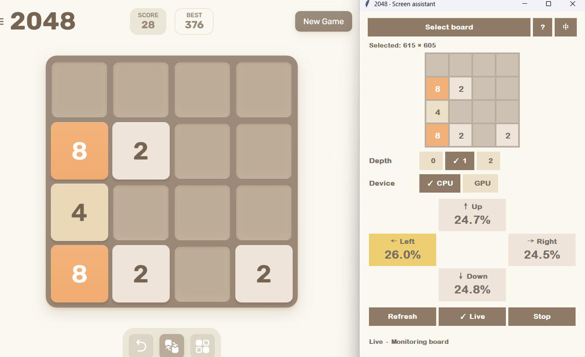

# Alpha2048

[简体中文](README.md) | **English**

A desktop 2048 game with a learned AI, plus a separate screen assistant that reads an external 4×4 board and recommends moves.

<p align="center">
  
</p>

## Algorithm performance

Results from 100 games of automatic play at depth 1:

| Mean score | Median | Reached 2048 | Reached 4096 | Reached 8192 |
|---:|---:|---:|---:|---:|
| **121,442** | **130,266** | **100%** | **99%** | **56%** |

### AI assistant

<p align="center">
  
</p>

The cross layout shows the model's relative preference for each direction. The assistant supports depths 0 / 1 / 2, one-step execution and automatic play.

- **Game:** keyboard play, sliding animations, score tracking, and a 2048 celebration.
- **Game AI:** recommendations, single-step execution and automatic play; search depths 0/1/2.
- **Screen assistant:** select a visible board, inspect recognized tiles and receive live recommendations. It never sends game input.
- English and Chinese interfaces. All inference runs locally.

## Screen assistant

<p align="center">
  
</p>

Select an external 2048 board and the screen assistant recognizes its tiles and continuously updates its move recommendation. It provides advice without controlling the external game.

## Controls

Use arrow keys or WASD to play; R or ↻ restarts. `?` opens help and `中 / EN` switches language. The AI panel provides recommendations, one step, auto and stop. Manual input pauses automatic play. Reaching 2048 pauses auto once and still allows continued play.

For the screen assistant, select the entire outer edge of the board. Live polling starts automatically. Keep the board visible and place the assistant beside it. Re-select after scrolling, moving the browser or changing zoom. Verify the recognized preview; uncertain recognition waits rather than inventing a move. See [screen assistant usage](docs/screen-assistant.md).

Recommendation percentages express relative model preferences, not win probabilities.

## Model and algorithm

A 206,849-parameter Transformer evaluates afterstates; expectimax accounts for random tile spawns. See [model and search details](docs/model-and-algorithm.md). The runtime uses `models/latest/best.pt`; OCR uses the English PP-OCRv4 ONNX recognizer in `assets/ocr/`.

Training datasets, optimizer state, previous checkpoints and development archives are not part of the public distribution. The supplied model supports inference; this repository is not a complete training-reproduction package.

## Download and run

Download the Windows CPU version from [Releases](https://github.com/tonghua-lin/Alpha2048/releases). Download and extract the entire ZIP, then open:

- `2048.exe` — game and game AI.
- `ScreenAssistant.exe` — external-board recommendations.

Keep the `_internal` directory beside both executables. The packaged application uses CPU by default and needs no Python or CUDA installation. GPU requires CUDA; run from source and test it on your system.

## Run from source

Windows x64 and Python 3.12 are the tested development target. Python must include Tkinter.

```powershell
git clone https://github.com/tonghua-lin/Alpha2048.git
cd Alpha2048
py -3.12 -m venv .venv
.\.venv\Scripts\python.exe -m pip install torch==2.14.0 --index-url https://download.pytorch.org/whl/cpu
.\.venv\Scripts\python.exe -m pip install -e ".[screen]"
.\.venv\Scripts\python.exe -m alpha2048
.\.venv\Scripts\python.exe -m alpha2048.screen_assistant
```

Run these commands from the repository root. Keep the repository assets alongside the source. For manual play without AI/OCR, installing `-e .` is enough. The game loads its AI runtime only when requested.

The packaged application uses CPU by default. GPU requires CUDA; install CUDA-enabled PyTorch and test it from source on your system. OCR always uses CPU.

## Tests

```powershell
.\.venv\Scripts\python.exe -m unittest discover -s tests -v
```

Tests include Tk windows and require an interactive desktop session. CUDA-specific checks are skipped when CUDA is unavailable. OCR fixture tests use only the cropped board under `tests/fixtures`.

## Repository layout

- `alpha2048/`: game, UI, recognition and inference code; diagnostic search tools.
- `models/latest/`: latest inference model and provenance.
- `assets/ocr/`: OCR model and dictionary.
- `tests/`: bounded checks and the cropped OCR fixture.
- `docs/`: usage and algorithm documentation.

## Third-party material

OCR is based on PaddlePaddle's [PaddleOCR](https://github.com/PaddlePaddle/PaddleOCR), using the [DeepGHS ONNX conversion](https://huggingface.co/deepghs/paddleocr/tree/main/rec/en_PP-OCRv4_rec). Original model release: [English PP-OCRv4](https://paddleocr.bj.bcebos.com/PP-OCRv4/english/en_PP-OCRv4_rec_infer.tar). License copies and source attribution are in [THIRD_PARTY_NOTICES.md](THIRD_PARTY_NOTICES.md). System fonts are used without bundling font files. This project is not affiliated with play2048.co.

## License

A project-wide license for the original code and game model has not yet been selected. Third-party components retain their own terms; see [THIRD_PARTY_NOTICES.md](THIRD_PARTY_NOTICES.md).
