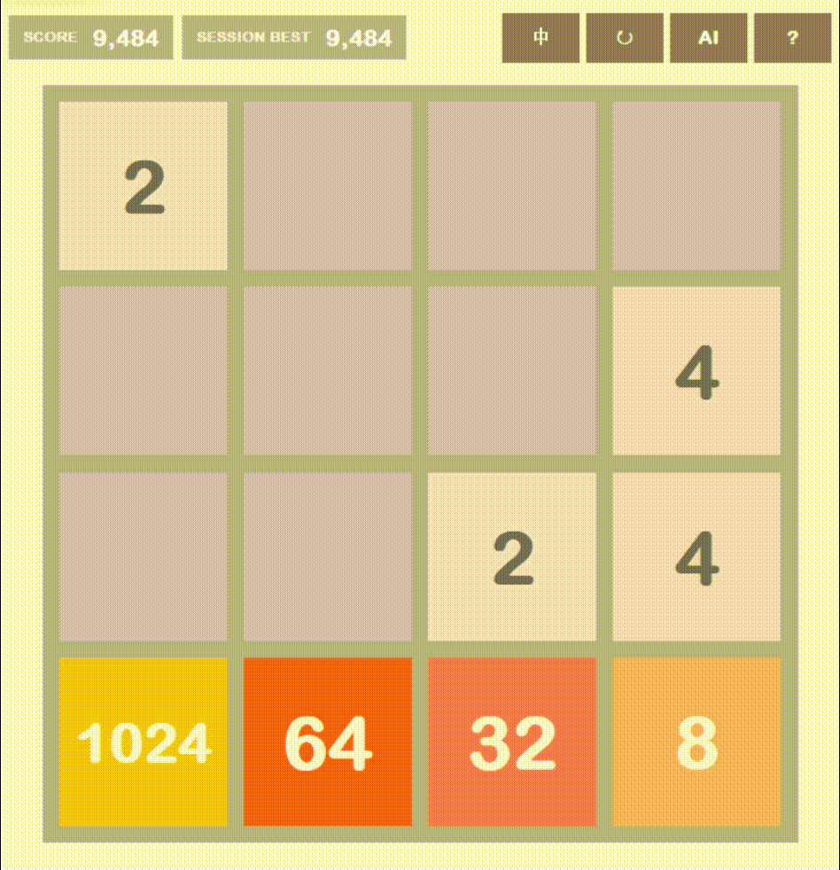
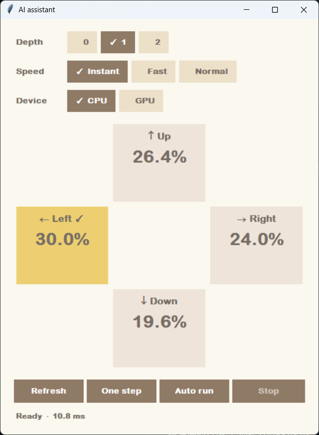

# Alpha2048

**简体中文** | [English](README.en.md)

一个带AI求解器的桌面2048游戏，以及独立的屏幕助手：识别外部 4×4 棋盘，提供操作推荐。

<p align="center">
  
</p>

## 算法表现

100 局自动游戏测试（depth 1）：

| 平均分 | 中位数 | 达到 4096 | 达到 8192 |
|---:|---:|---:|---:|
| **121,442** | **130,266** | **99%** | **56%** |

### AI 助手界面

<p align="center">
  
</p>

AI 助手以十字布局显示四个方向的相对推荐度，支持 depth 0 / 1 / 2、单步执行和自动运行。

- **游戏**：标准的2048游戏。
- **游戏 AI**：支持给出当前操作建议，单步运行，自动运行等。
- **屏幕助手**：框选可见棋盘，预览识别结果，实时获得推荐。不会代操作外部游戏。
- 界面支持中文、英文切换，所有推理均在本地完成。

## 下载与运行

在 [Releases](https://github.com/tonghua-lin/Alpha2048/releases) 下载 Windows CPU 版。完整解压 ZIP 后运行：

- `2048.exe`：游戏及游戏内 AI。
- `ScreenAssistant.exe`：外部棋盘识别和推荐。

请保留两个 EXE 旁边的 `_internal` 文件夹。CPU 版不需要安装 Python 或 CUDA，选择 GPU 时会提示不可用。

## 从源码运行

已验证的开发环境是 Windows x64、Python 3.12。Python 需包含 Tkinter。

```powershell
git clone https://github.com/tonghua-lin/Alpha2048.git
cd Alpha2048
py -3.12 -m venv .venv
.\.venv\Scripts\python.exe -m pip install torch==2.14.0 --index-url https://download.pytorch.org/whl/cpu
.\.venv\Scripts\python.exe -m pip install -e ".[screen]"
.\.venv\Scripts\python.exe -m alpha2048
.\.venv\Scripts\python.exe -m alpha2048.screen_assistant
```

在仓库根目录执行以上命令。模型资源需与源码保留在一起。若只需要手动游戏，不使用 AI 或识屏，安装 `-e .` 即可。游戏仅在需要 AI 时加载推理运行库。

源码环境可安装支持 CUDA 的 PyTorch，在兼容的 NVIDIA 显卡上运行搜索。免安装发布版仅使用 CPU，OCR 始终使用 CPU。

## 操作方法

使用方向键或 WASD 移动；R 或 ↻ 重新开始。`?` 打开帮助，`中 / EN` 切换语言。AI 面板提供建议、单步、自动运行与停止。手动操作会暂停自动运行；每局首次达到 2048 时也会暂停，之后仍可继续游戏或重新开启自动运行。

屏幕助手需要沿整个棋盘的外边缘框选，完成后自动开始轮询。保持棋盘可见，将助手放在棋盘旁边。移动浏览器、滚动或改变缩放后需重新框选。请核对识别预览；识别不清晰时会等待，不会把错误识别直接用于推荐。详见[屏幕助手说明（英文）](docs/screen-assistant.md)。

推荐百分比表示模型的相对偏好，不是获胜概率。

## 模型与算法

使用一个含 206,849 个参数的 Transformer 对 afterstate（移动合并后、随机落子前的棋盘）估值，再通过 expectimax 搜索考虑随机落子的影响。详见[模型与搜索说明（英文）](docs/model-and-algorithm.md)。游戏推理使用 `models/latest/best.pt`；数字识别使用 `assets/ocr/` 中的英文 PP-OCRv4 ONNX 模型。

公开仓库不包含训练数据、优化器状态、旧 checkpoint 或开发归档。提供的模型用于推理，本仓库不是完整的训练复现包。

## 测试

```powershell
.\.venv\Scripts\python.exe -m unittest discover -s tests -v
```

测试包含 Tk 窗口，需要交互式桌面环境。没有 CUDA 时会跳过对应 GPU 测试。OCR 测试只使用 `tests/fixtures` 中裁剪后的棋盘图片。

## 目录结构

- `alpha2048/`：游戏、界面、识别、推理代码及搜索诊断工具。
- `models/latest/`：最新推理模型及来源信息。
- `assets/ocr/`：OCR 模型和字典。
- `tests/`：有界检查及裁剪后的 OCR 测试图片。
- `docs/`：使用与算法文档。

## 第三方资源

OCR 基于 PaddlePaddle 的 [PaddleOCR](https://github.com/PaddlePaddle/PaddleOCR)，采用 [DeepGHS 提供的 ONNX 转换](https://huggingface.co/deepghs/paddleocr/tree/main/rec/en_PP-OCRv4_rec)。原始模型为[英文 PP-OCRv4](https://paddleocr.bj.bcebos.com/PP-OCRv4/english/en_PP-OCRv4_rec_infer.tar)。许可副本与来源声明见 [THIRD_PARTY_NOTICES.md](THIRD_PARTY_NOTICES.md)。程序使用系统已有字体，不分发字体文件。本项目与 play2048.co 无关联。

## 许可证

项目原创代码和游戏模型的统一许可证尚未确定。第三方组件保留各自的许可条款，详见 [THIRD_PARTY_NOTICES.md](THIRD_PARTY_NOTICES.md)。
